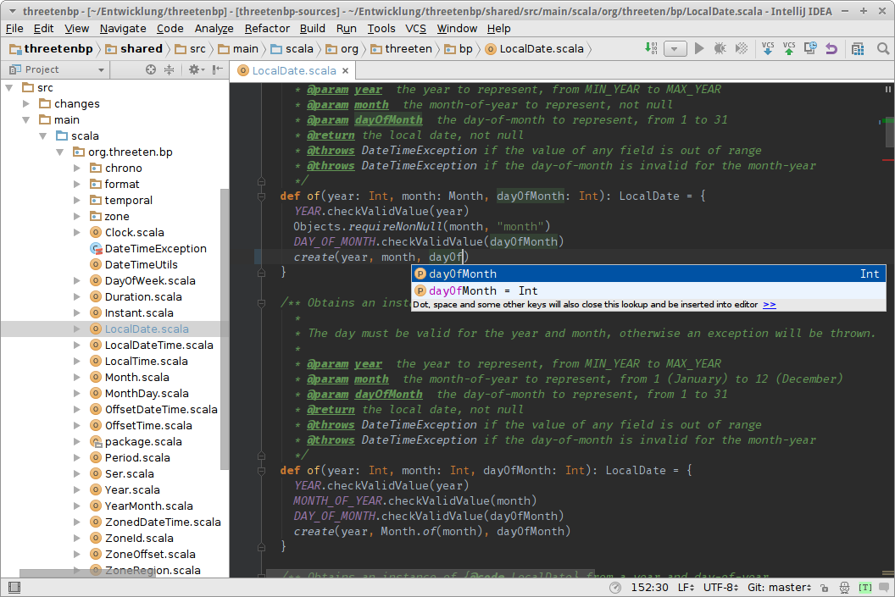

**Please note that Scala 2.12 has not been officially announced or released yet.**

**Artifacts of Scala 2.12 have been published to Maven repositories and library authors are encouraged to build their libraries against 2.12.**

**After important libraries have been published for 2.12, the release will be officially announced.**

<!-- -->

## Overview

One important goal of Scala 2.12 was to make optimal use of Java 8's new features (and thus generates code that requires a Java 8 runtime).

- Traits ([#5003](https://github.com/scala/scala/pull/5003)) are [compiled to an interface with default methods (where possible)](#traits-compile-to-interfaces) for improved binary compatibility. The compiler no longer generates trait implementation classes (`T$class.class`) and anonymous function classes (`C$$anonfun$1.class`).
- We treat Single Abstract Method types and Scala's builtin function types uniformly from [type checking](#first-class-support-for-sam-types) to the [back end](#java-8-style-lambdas) ([#4971](https://github.com/scala/scala/pull/4971)). Code generation for function literals uses `invokedynamic` to avoid emitting a classfile at compile time.
- In addition to compiling functions, we also use `invokedynamic` for a more natural encoding of [other language features](#use-of-invokedynamic).
- We've standardized on the [GenBCode back end](#new-back-end) ([#4814](https://github.com/scala/scala/pull/4814), [#4838](https://github.com/scala/scala/pull/4838)) and the [flat classpath implementation](#reduced-memory-usage-during-compilation) is now the default ([#5057](https://github.com/scala/scala/pull/5057)).
- The [optimizer](#new-optimizer) has been completely overhauled for 2.12.

In addition to that, an amazing amount of work has happened to run Scala on [other platforms](#platform-status),
[improve](#new-features) the standard library and the compiler, [polish](#changes) the language,
introduce [cleanups](#cleanups) throughout the codebase,
and provide new tools ([Scalafmt](#scalafmt), [Scalafix](#scalafix)) as well as
services ([Scaladex](#scaladex), [ScalaFiddle](#scalafiddle)) to Scala developers.

Many of these features were developed in fruitful collaboration with the [Dotty](https://lampepfl.github.io/dotty) team.

## Platform status

### Scala on the JVM

Scala 2.12 requires a Java 8 runtime to compile code. It requires at least Java 8 to run the generated code.
2.12.1 will be out shortly (by the end of November) to address some known (but rare) issues in 2.12.0.

Scala 2.11 requires a Java 6, 7 or 8 runtime to compile code. It requires Java 6, 7 or 8 to run the generated code.
2.11.9 is the last planned 2.11.x release (due by mid December).

In the next few weeks, we at Lightbend will share our plans for Scala 2.13.

### Scala.js

Scala.js emits standard JavaScript that runs in all popular browsers (ECMAScript 5.1 Strict Mode or ECMAScript 2015).
It has been [production-ready](news/2015/02/05/scala-js-no-longer-experimental.html) since the beginning of 2015.

> I have done some work with GWT before and compared to that the first thing you will notice is that Scala.js is FAST.
> It compiles 100 times faster, yet it still outputs JavaScript that is both faster and smaller.
>
> – Baldur Norddahl

Scala.js has amazing interoperability with all JavaScript libraries and can use many Scala libraries,
allowing developers to share code between client and server.

> Scala.js has very good tooling and very good documentation.
> If you already write JVM flavoured Scala you can be up and running in no time and write JS flavoured Scala.
>
> – Guillaume Belrose

Scala.js supports [CommonJS modules](https://www.scala-js.org/doc/project/module.html) and can [directly work with npm dependencies](blog/2016/10/19/scalajs-bundler.html).

The current version of Scala.js is 0.6.13 and requires Scala 2.10, 2.11 or 2.12 to compile Scala code to JavaScript.

To use Scala.js, add the plugin to your plugin configuration (`project/pluins.sbt`):

    addSbtPlugin("org.scala-js" % "sbt-scalajs" % "0.6.13")

After that, you can enable Scala-to-JavaScript compilation by adding

    enablePlugins(ScalaJSPlugin)

to your build configuration (`build.sbt`).

The [Scala.js website](https://scala-js.org) provides further information.

### Scala on Android

Scala on Android allows you to write Android apps in Scala.
The current version of Scala on Android is 1.7.1.

Scala on Android requires Scala 2.11.
Support for Scala 2.12 is pending as Google's support for converting Java 8 bytecode
to Android's native executable format is not production-ready yet.

To start using Scala on Android, add the plugin to your plugin configuration (`project/pluins.sbt`):

    addSbtPlugin("org.scala-android" % "sbt-android" % "1.7.1")

After that, you can enable Android support by adding

    enablePlugins(AndroidApp)

to your build configuration (`build.sbt`).

The custom ProGuard caching provided by the Android plugin integrates with
incremental compilation, which allows skipping the ProGuard step and shaving off
significant amounts of time during development!

An optional extension of this plugin, [`sbt-android-protify`](https://github.com/scala-android/sbt-android-protify),
provides even further speed-ups by allowing you to make changes to your code and
see those changes reflected immediately on your device (or emulator):

<iframe width="560" height="315" src="https://www.youtube.com/embed/LJLLyua0bYA" frameborder="0" allowfullscreen></iframe>

Unlike Google's _Instant Run_ feature, this functionality also works on devices running earlier versions than Android 5.0.

Another optional extension of this plugin, [`sbt-android-gradle`](https://github.com/scala-android/sbt-android/blob/master/GRADLE.md),
automatically imports an existing `build.gradle` file, which means you can get started without writing any SBT build configuration.

Writing Android apps with Scala adds a small size overhead that depends on how much
functionality from the Scala standard library is used.
Currently, the minimal overhead is about 30kB.

A [new, dedicated website](http://scala-android.org) helps you to get started using Scala on Android devices.

### Scala-Native

Scala-Native compiles Scala to native code and provides seamless interoperability with C.

It uses LLVM for code generation and currently supports Linux and macOS.
Additional targets are planned and will be added in time.

Even at this early stage performance has been very promising:
A simple ray-tracer written in Scala-Native is close in speed to the equivalent code written in C++.

To try Scala-Native, you need to have [LLVM and BoehmGC installed](https://scala-native.readthedocs.io/en/latest/user/setup.html).

Then add the Scala-Native plugin to your plugin configuration (`project/pluins.sbt`):

    // Scala-Native releases only snapshot builds
    resolvers += Resolver.sonatypeRepo("snapshots")
    addSbtPlugin("org.scala-native" % "sbtplugin"  % "0.1-SNAPSHOT")

After that, you can enable native compilation by adding

    enablePlugins(ScalaNativePlugin)

to your build configuration (`build.sbt`).

Scala-Native uses Scala 2.11 currently, support for 2.12 will be added with
[the release of Scala-Native 0.1](https://github.com/scala-native/scala-native/milestone/5).

We are extremely grateful for the support Scala-Native received from many contributors:
In only 4 months since the announcement in May it has already accepted more than 100 contributions.

The [Scala-Native documentation](https://scala-native.readthedocs.io) provides further information.

### Dotty

Dotty is a platform to try out new language concepts and compiler technologies for Scala.
The focus is mainly on simplification. We remove extraneous syntax (e.g. no XML literals),
and try to boil down Scala's types into a smaller set of more fundamental constructors.

The Dotty team has already implemented union, intersection, literal singleton types as well as
trait parameters and [many more improvements](https://lampepfl.github.io/dotty/#so-features) designed to
come up with an even more minimal, orthogonal language design.

The theory behind these constructors is researched in
[DOT](http://www.cs.uwm.edu/~boyland/fool2012/papers/fool2012_submission_3.pdf),
a calculus for dependent object types.

Dotty's current status as a _technology preview_ means that it is unsupported,
may be functionally incomplete or unsuitable for production use.

To [try Dotty](https://lampepfl.github.io/dotty/#getting-started), add the Dotty plugin to your plugin configuration (`project/pluins.sbt`):

    addSbtPlugin("com.felixmulder" % "sbt-dotty" % "0.1.4")

After that, you can enable compilation with Dotty by adding

    enablePlugins(DottyPlugin)

to your build configuration (`build.sbt`).

If you are interested in more details, visit the [Dotty homepage](https://lampepfl.github.io/dotty)
or watch [Martin Odersky](https://github.com/odersky)'s talk on Dotty and compiler design:

<iframe width="560" height="315" src="https://www.youtube.com/embed/w1ca4KL9UXc" frameborder="0" allowfullscreen></iframe>

## New features
Here are the [most noteworthy pull request](https://github.com/scala/scala/pulls?utf8=%E2%9C%93&q=%20is%3Amerged%20label%3A2.12%20label%3Arelease-notes%20) of the 2.12 release. See also the [RC2](http://scala-lang.org/news/2.12.0-RC2) and [RC1](http://scala-lang.org/news/2.12.0-RC1) release notes for the most recent changes.

### Traits compile to interfaces

With Java 8 allowing concrete methods in interfaces ("default methods"), Scala 2.12 is able to compile a trait to a single interface.

Before, a trait was represented as an interface and a class that held the method implementations.

Due to technical limitations of default methods, the compiler still has quite a bit of magic to perform behind the scenes, so that care must be taken if a trait is meant to be implemented in Java. Briefly, if a trait does any of the following its subclasses require synthetic code:

- defining fields
- calling `super`
- initializer statements in the body
- extending a class
- relying on linearization to find implementations in the right super trait

### Java 8-style lambdas

Scala 2.12 emits closures in the same style as Java 8, whether they target a `FunctionN` class from the standard library or a user-defined _Single Abstract Method_ (SAM) type.

The type checker accepts a function literal as a valid expression for either kind of "function-like" type (built-in or SAM). This improves the experience of using libraries written for Java 8 in Scala:

    def runRunnable(runnable: Runnable) = runnable.run
    runRunnable(() => println("Hello SAM!"))
    // result:
    // Hello SAM!

For each lambda the compiler generates a method containing the lambda body, and emits an `invokedynamic` that will spin up a lightweight class for this closure using the JDK's `LambdaMetaFactory`. Note that in the following situations, the an anonymous function class is still synthesized at compile-time:

- If the SAM type is not a simple interface, for example an abstract class or a triat with a field definition (see [#4971](https://github.com/scala/scala/pull/4971))
- If the abstract method is specialized - except for `scala.FunctionN`, whose specialized variants can be instantiated using `LambdaMetaFactory` (see [#4971](https://github.com/scala/scala/pull/4971))
- If the function literal is defined in a constructor or a super call ([#3616](https://github.com/scala/scala/pull/3616))

### Smaller JAR and class files

Compared to Scala 2.11, the new scheme has the advantage that–in most cases–the compiler does not need to generate an anonymous class for each closure.

Combined with the improvements in compiling traits to interfaces with default methods, this leads to significantly smaller JAR files:

|                           | 2.9  | 2.10 | 2.11 | 2.12 |
|---------------------------|-----:|-----:|-----:|-----:|
|Scala library              |  9.0 |  7.1 |  5.7 |  5.5 |
|Scala compiler             | 11.5 | 14.5 | 15.5 | 10.1 |
|ScalaTest   (3.0.0)        |      | 10.5 | 10.4 |  7.0 |

<!--|Akka Actors (2.4.8)        |      |      |  3.2 |    ? |-->

Actual size improvements depend heavily on the style of code you are writing,
code bases that create lambdas benefit from these improvements disproportionally.

We have received reports ranging from a 5% reduction in code size to decreases of 50%.

Please let us know your experience and report any regressions you find!

### New back end

Scala 2.12 standardizes on the "GenBCode" back end, which emits code more quickly because it directly generates bytecode from Scala compiler trees, while the previous back end used an intermediate representation called "ICode".
The old back ends (GenASM and GenIcode) have been removed ([#4814](https://github.com/scala/scala/pull/4814), [#4838](https://github.com/scala/scala/pull/4838)).

### New optimizer

The GenBCode back end includes a new inliner and bytecode optimizer,
delivered by [Lukas Rytz](https://github.com/lrytz), and built on earlier work by Miguel Garcia.

Many more (effectively) final methods, including those defined in objects and traits, are now inlined.
Closure allocations, dead code and [box/unbox pairs](https://github.com/scala/scala/pull/4858) are also eliminated more effectively.

The optimizer is enabled using `-opt` compiler option, which defaults
to `-opt:l:classpath`.  Check `-opt:help` to see the full list of
available options for the optimizer.

The following optimizations are available:

* Inlining final methods, including methods defined in objects and final methods defined in traits
* If a closure is allocated and invoked within the same method, the closure invocation is replaced by an invocations of the corresponding lambda body method
* Dead code elimination and a small number of cleanup optimizations
* Box/unbox elimination [#4858](https://github.com/scala/scala/pull/4858)

In addition to that, the `@inline` and `@noinline` annotations can now be added to method calls:

    // @inline // we don't want to inline all the time, ...
    def addOne(x: Int) = x + 1
    addOne(23): @inline // ... but here we want to inline!

### Either is now right-biased

`Either` now supports operations like `map`, `flatMap`, `contains`,
`toOption`, and so forth, which operate on the right-hand side.

(`.left` and `.right` may be deprecated in favor of `.swap` in a later release.)

The changes are source-compatible with old code (except in the
presence of conflicting extension methods).

Important libraries like [cats](http://typelevel.org/cats/) have already deprecated
their own implementation of a right-biased Either, standardizing on `scala.util.Either` in the future.

Thanks, [Simon Ochsenreither](https://github.com/soc), for this
contribution.

### Improved Futures

`scala.concurrent.Future` gained a few new combinators and utility functions, including
[`flatten`](https://github.com/viktorklang/blog/blob/master/Futures-in-Scala-2.12-part-1.md),
[`zipWith`](https://github.com/viktorklang/blog/blob/master/Futures-in-Scala-2.12-part-2.md),
[`transform`](https://github.com/viktorklang/blog/blob/master/Futures-in-Scala-2.12-part-3.md),
[`transformWith`](https://github.com/viktorklang/blog/blob/master/Futures-in-Scala-2.12-part-4.md) and
[`unit` and `never`](https://github.com/viktorklang/blog/blob/master/Futures-in-Scala-2.12-part-6.md).

In addition to that, `Future`s also received further performance tuning and and improvements to the behavior of long chains of `Future`s.

This [blog post series](https://github.com/viktorklang/blog)
by [Viktor Klang](https://github.com/viktorklang) explores the diverse improvements made to `Future` for 2.12.

### Improved REPL

Scala's REPL (read-evaluate-print-loop) ships with many improvements,
like support for colored output (enable with `-Dscala.color`).

The implementation of tab-completion in the Scala REPL has been rewritten and now uses the same infrastructure as for example Scala IDE and ENSIME.

There are a number of improvements:

* Reliable completion, also in partial expressions and syntactically incorrect programs: try `class C { def f(l: List[Int]) = l.<TAB>`
* CamelCase completion: try `(l: List[Int]).rro<TAB>`, it expands to `(l: List[Int]).reduceRightOption`
* Show desugarings performed by the compiler by adding `//print`: try `for (x <- 1 to 10) println(x) //print<TAB>`
* Complete bean getters without typing `get`: try `(d: java.util.Date).day<TAB>`
* Find members by typing any CamelCased part of the name: try `classOf[String].typ<TAB>` to get `getAnnotationsByType`, `getComponentType` and others
* Complete non-qualified names, including types: try `def f(s: Str<TAB>`
* Press tab twice to see the method signature: try `List(1,2,3).part<TAB>`, which completes to `List(1,2,3).partition`; press tab again to display `def partition(p: Int => Boolean): (List[Int], List[Int])`

Thanks to [Jason Zaug](https://github.com/retronym) and [Andrew Marki](https://github.com/som-snytt) for their fruitful collaboration on this work!

These improvements have also been added to Scala 2.11.

### Collection improvements

Apart from many general fixes and polishing, the performance of
`Iterator`, `Map`, `Set`, `ListMap`, `ListSet`, `PriorityQueue`, `OpenHashMap`, `ArrayStack`
has been improved, in some cases significantly.

An implementation of a mutable `TreeMap` has been added.

Thanks to the many contributors who have worked on this!

### Better deprecations and library evolution

As library authors–regardless of programming language–know, evolving code is hard
as most changes are not considered to be binary compatible on the JVM.

While Java itself has adopted one approach of addressing this issue ("never change anything"),
this strategy does not work for all library authors.

To help library authors evolve their libraries (while avoiding unexpected breakages and unnecessary warnings for their users at the same time)
Scala has greatly extended and improved the way library authors can communicate upcoming changes to their users.

Scala now provides the `@deprecatedInheritance` and the `@deprecatedOverriding` annotations
in addition to the existing `@deprecated` and `@deprecatedName` annotations in [SI-6162](https://issues.scala-lang.org/browse/SI-6162).

The `@deprecatedInheritance` annotation signals that inheriting from a class is deprecated.

This is usually done to warn about a non-final class being made final in a future version. Sub-classing such a class then generates a warning:

    // Library code
    @deprecatedInheritance("this class will be made final", "FooLib 12.0")
    class Foo

    // User code
    val foo = new Foo     // no deprecation warning
    class Bar extends Foo
    // warning: inheritance from class Foo is deprecated (since FooLib 12.0):
    //          this class will be made final
    // class Bar extends Foo
    //                   ^

No warnings are generated if the subclass is in the same compilation unit.

The `@deprecatedOverriding` annotation signals that overriding a member is deprecated. Overriding such a member in a sub-class then generates a warning:

    // Library code
    class Foo {
      @deprecatedOverriding("this method will be made final", "FooLib 12.0")
      def add(x: Int, y: Int) = x + y
    }

    // User code
    class Bar extends Foo // no deprecation warning
    class Baz extends Foo {
      override def add(x: Int, y: Int) = x - y
    }
    // warning: overriding method add in class Foo is deprecated (since FooLib 12.0):
    //          this method will be made final
    // override def add(x: Int, y: Int) = x - y
    //              ^

Additionally, all reports of deprecations (including language deprecations) are now grouped by their `since` field ([#5076](https://github.com/scala/scala/pull/5076)),
making it easy to tell which changes are upcoming and prioritize accordingly:

    // Library code
    @deprecated("this method will be removed", "FooLib 12.0")
    def oldMethod(x: Int) = ...

    // User code
    oldMethod(1)
    oldMethod(2)
    aDeprecatedMethodFromLibraryBar(3, 4)
    // warning: there was one deprecation warning (since BarLib 3.2)
    // warning: there were two deprecation warnings (since FooLib 12.0)
    // warning: there were three deprecation warnings in total;
    //          re-run with -deprecation for details

Library authors should document their library's deprecation policy to give developers guidance on how long a deprecated definition will be preserved.
We encourage library authors to prepend the name of their library to the version number to help developers distinguish deprecations coming from different libraries.

### New Scaladoc look-and-feel

Scaladoc's output is now more attractive, more modern, and easier
to use. The unified search makes sure developers find the class, object, method
or value they are looking for:

Thanks, [Felix Mulder](https://github.com/felixmulder), for leading
this effort.

### Scaladoc support for Java sources

This allows `scaladoc` to generate comprehensive documentation from projects with both Scala and Java sources.
Thanks, [Jakob Odersky](https://github.com/jodersky), for this fix to [SI-4826](https://issues.scala-lang.org/browse/SI-4826).

This feature is enabled by default, but can be disabled with:

    scalacOptions in (Compile, doc) += "-no-java-comments"

### Parameter names available at runtime

Java 8 added a mechanism in [JEP-118](http://openjdk.java.net/jeps/118)
to store parameter names in class files and read this information at runtime
using reflection.

While `javac` requires an additional flag to emit parameter names, Scala 2.12 emits them by default:

    case class Person(name: String, age: Int)
    classOf[Person].getConstructors.head.getParameters
    // result:
    // Array(final java.lang.String name, final int age)

### Partial unification of type constructors

Compiling with `-Ypartial-unification` adds partial unification of type constructors,
fixing the notorious [SI-2712](https://issues.scala-lang.org/browse/SI-2712).

For starters, here is the sort of code affected by SI-2712:

    def foo[F[_], A](fa: F[A]): String = fa.toString

    foo { x: Int => x * 2 }

We're calling the `foo` function, passing a value of type `Int => Int`, which is syntactic sugar for `Function1[Int, Int]`.  In the meantime, `foo` expects a parameter of type `F[A]`, where `F[_]` and `A` are unsolved type variables.  This will not compile.

The reason it does not compile is because `Function1` takes *two* type parameters, whereas `F[_]` only takes one.  The compiler tries to instantiate `F[_] = Function1[_, _]`, but it doesn't work because the number of parameters doesn't line up, and it fails the build.

With this fix, the above snippet compiles without modification and behaves exactly as you would expect.  In fact, nearly every example of SI-2712 magically springs to life and just starts working exactly the way you want it to.  Specifically in the above example, the compiler will see that we are passing a value of a type constructor with two parameters (`Function1`) to a function (`foo`) that expects a value of a type constructor with one parameter (`F[_]`), and it will handle the situation by *assuming* that there is some other type constructor which is a partial application from the left of `Function1`.

The fix assumes that type constructors are always partially applied in a left-to-right order.  Whenever the compiler infers a type constructor which has a higher arity than the type constructor it *really* needs, it will assume that the type constructor it was supposed to infer was some partial application of the larger one.  For example:

    // required
    F[_, _, _]

    // provided
    Foo[Monad, Int, String, Boolean, Unit]

    // inferred
    [A, B, C]Foo[Monad, Int, A, B, C]

The compiler will only ever infer these "placeholder" parameters on the *right* side of the type constructor.  Never on the left.  This has some very significant implications for the way in which you design data types.

This improvement has been backported to Scala 2.11 and will ship with the next minor release, 2.11.9.

Thanks to [Miles Sabin](https://github.com/milessabin) for implementing this long-standing feature request and to [Daniel Spiewak](https://github.com/djspiewak) for  this [description of the issue and how it was addressed](https://gist.github.com/djspiewak/7a81a395c461fd3a09a6941d4cd040f2).

### Use of `invokedynamic`

In addition to lambda support, [caches for structural calls and Symbol literals](https://github.com/scala/scala/commit/df0d105)
are also implemented with `invokedynamic` now.

The `invokedynamic` instruction can also be used in macros, allowing macro authors
to hoist and cache expensive computations (like Regex pattern compilation).

## Cleanups

The code base has been significantly improved, cleaning up and removing a lot of code.
This has delivered great results, a few of which we want to mention:

### Fields phase

Scala doesn't provide a way to define fields directly. Nevertheless, they need to be emitted by the compiler when values, lazy values, variables, objects etc. are defined.

The creation of these fields was spread over multiple phases in the compiler.

This has been cleaned up in [#5141](https://github.com/scala/scala/pull/5141)
and #[5294](https://github.com/scala/scala/pull/5294) by introducing a dedicated phase called "fields".

This change was inspired by [Dotty](https://lampepfl.github.io/dotty) and simplified many parts of the compiler,
[improving type inference](#more-consistent-type-inference-for-vals) along the way.

### Ant build replaced with SBT build

The Ant build used to compile Scala itself has been replaced by an SBT build,
vastly simplifying the implementation and the process to build, test and create artifacts.

### Removal of the old compiler backend

The old GenASM backend and the ICode infrastructure has been removed in favor of the GenBCode backend,
simplifying and minimizing the last stages of the compilation pipeline.

### `sun.misc.Unsafe` replacement

In preparation of future Java releases which might limit access to "special" classes
like `sun.misc.Unsafe`, all usages of such classes have been replaced by other implementations.

[Viktor Klang's blog post](https://github.com/viktorklang/blog/blob/master/Futures-in-Scala-2.12-part-8.md) gives some insights based on his work on `Future`s.

### Removal of ForkJoin library

Earlier releases of the Scala standard library included the ForkJoin library.

As Java 8 has finally included the ForkJoin library in its standard library,
and Scala 2.12 requires Java 8, this code has been dropped from the Scala
standard library, reducing its size.

### Reduced memory usage during compilation

The parts of the compiler that read class files during compilation have been improved,
substantially reducing the amount of memory used.

### Fewer dependencies for `scaladoc`

The `scaladoc` tool drops its dependency on the parser-combinators library,
making it easier to evolve, build and publish.

## Changes

Except for the changes listed below, code that compiles on 2.11.x without deprecation warnings
should compile on 2.12.x too, unless you use experimental APIs such as reflection.

If you find incompatibilities, please [file an issue](https://issues.scala-lang.org).

### First-class support for SAM types

Since the compiler has received first-class support for _Single Abstract Method types_,
this conversion will be preferred to user-defined implicit conversion of function types to SAM types now:

    trait MySam { def apply(x: Int): String }
    implicit def unused(fun: Int => String): MySam =
      new MySam { def apply(x: Int) = fun(x) }
    // uses SAM conversion, not the `unused` implicit
    val sammy: MySam = (_: Int).toString

To retain the old behavior, you may compile under `-Xsource:2.11`, or disqualify the type from being a SAM (e.g. by adding a second abstract method).

Support for SAM types can be enabled in Scala 2.11 by setting the `-Xexperimental` flag.

### More consistent type inference for `val`s

[#5141](https://github.com/scala/scala/pull/5141) and
[#5294](https://github.com/scala/scala/pull/5294) align type
inference for `def`, `val`, and `lazy val`, fixing assorted
corner cases and inconsistencies.  As a result, the inferred type
of a `val` or `lazy val` may change.

In particular, `implicit val`s that didn't need explicitly declared
types before may need them now.  (This is always good practice
anyway.)

You can get the old behavior with `-Xsource:2.11`.  This may be
useful for testing whether these changes are responsible if your
code fails to compile.

[Lazy vals and objects](https://github.com/scala/scala/pull/5294) have been reworked,
and those defined in methods now use a [more efficient representation](https://github.com/scala/scala/pull/5374)
that allows synchronization on the holder of the `lazy val`, instead of the surrounding class (as in Dotty).

### Improvements to method conversions

Scala considers adapting a method without an argument list in multiple steps to figure out whether some requested type can be satisfied.

One of those steps is _eta-expansion_, which happens before _empty application_. In some cases considering eta-expansion before empty application would cause the compiler to reject code that could have been accepted if empty application happened before eta-expansion.

Eta-expansion before empty application has been deprecated in 2.12 and will be swapped in 2.13.

### Improvements to internal syntax trees

PR [#4794](https://github.com/scala/scala/pull/4749) improved the syntax trees for selections of statically accessible symbols.

For example, a selection of `Predef` no longer has the shape `q"scala.this.Predef"` but simply `q"scala.Predef"`. Macros and compiler plugins matching on the old tree shape need to be adjusted.

This change only affects authors of macros and compiler plugins.

## Tooling

### SBT

SBT, the _Scala Build Tool_, is the backbone of every Scala project.

While Scala is well-supported by Maven, Ant and other build tools,
SBT provides some additional features to make your life much easier:

It manages and resolves dependencies, configures the build, incrementally compiles your source code,
runs tests, provides a project-specific console, creates artifacts and publishes them to repositories.

The recommended version of SBT is 0.13.13 which provides a glimpse of many upcoming
improvements of SBT 1.0 like auto plugins, launcher enhacements for SBT server,
defined in the `sbt-remote-control project`, and other necessary API changes.

The 0.13.x releases maintain binary compatibility with plugins that are published against SBT 0.13.0,
but add new features in preparation for SBT 1.0.
This allows us to test new ideas like auto plugins and performance improvements on dependency resolution;
the build users can try new features without losing the existing plugin resources;
and plugin authors can gradually migrate to the new plugin system before SBT 1.0 arrives.

Visit the [documentation](http://www.scala-sbt.org/0.13/docs/index.html) or the
[changelog](http://www.scala-sbt.org/0.13/docs/sbt-0.13-Tech-Previews.html) for further information!

### Scaladex

The Scala Center team is very proud to announce that [The Scala Package Index](https://index.scala-lang.org/), or Scaladex for short, has reached beta v1!
This means we're now confident that Scaladex is now in state where it is ready for widespread use.

Scaladex now supports most major features we planned for it, in addition to serving as an index of the known Scala ecosystem; self-updating, reindexing, user editing of published libraries (keywords, documentation links, and artifact deprecation), and more, even as we work to iron out user experience. In particular we'd like to thank contributors [Ronald Marske](https://github.com/Scyks), and [Rafa Paradela](https://github.com/rafaparadela) and [Israel Pérez](https://github.com/israelperezglez) from [47 Degrees](http://www.47deg.com/) in helping us to reach this milestone!

Here's a quick walkthrough we put together of some of Scaladex's main features:

<iframe width="610" height="315" src="https://www.youtube.com/embed/TBoJivIJsbU" frameborder="0" allowfullscreen></iframe>

Have a look at the [announcement](blog/2016/08/09/the-scala-library-index-reaches-beta) for further details!

### ScalaFiddle

ScalaFiddle, an online playground for exploring and sharing Scala code, has been released!

<iframe height="300" frameborder="0" style="width: 100%; overflow: hidden;" src="https://embed.scalafiddle.io/embed?sfid=UbLKYAK/1&theme=dark&layout=h60&responsiveWidth=600"></iframe>

Get started at [scalafiddle.io/sf/n6lR8Xh/2](https://scalafiddle.io/sf/n6lR8Xh/2)!

### Scalafmt

Scalafmt is a formatter for Scala source code and emits readable, idiomatic and consistently formatted Scala code.
It can be used as a stand-alone tool, integrated into your SBT build or as a library.

Check out [scalafmt.org](http://scalafmt.org) for more details!

### Scalafix

Scalafix is a newly released tool to automatically adapt existing Scala source code to future releases.
It takes care of easy, repetitive and tedious code transformations so you can focus on the changes that truly deserve your attention.

In a nutshell, scalafix reads a source file, transforms usage of unsupported features into newer alternatives, and writes the final result back to the original source file. Scalafix aims to automate the migration of as many unsupported features as possible. There will be cases where scalafix is unable to perform automatic migration. In such situations, scalafix will point to the offending source line and provide instructions on how to refactor the code.

Please have a look at the [scalafix announcement](blog/2016/10/24/scalafix) for more information.

### Migration Manager (MiMa)

The migration manager is a tool that can scan different versions of a library and point out binary incompatible changes.
This helps library authors of all JVM languages to make sure that their libraries follow their rules on compatibility like "no binary incompatible changes in minor releases".

MiMa can be used as a stand-alone tool or integrated into your SBT build. It has been updated to take the new capabilities of Java 8 bytecode into account.

[MiMa's Github page](https://github.com/typesafehub/migration-manager) provides more details.

## IDEs and editors

### IntelliJ

JetBrains provides a Scala plugin which works in the community as well as the commercial version of their IntelliJ IDE.

It turns IntelliJ into a fully featured Scala IDE offering syntax highlighting, warning/error markers, auto-completion, refactorings, inspections and intentions.

Just place a `*.scala` file in your project and IntelliJ will offer to download and install the IntelliJ Scala plugin.

Have a look at the [official documentation](https://www.jetbrains.com/help/idea/2016.2/creating-and-running-your-scala-application.html) for more information.

The Scala plugin for IntelliJ supports Scala 2.12.

### Eclipse

ScalaIDE, the Scala plugin for Eclipse, uses Scala 2.11 by default. Scala 2.10 and 2.12 can be configured manually.

In the coming weeks a new release of ScalaIDE will switch this default to Scala 2.12.

Have a look at the [features page](http://scala-ide.org/index.html#features) and the release notes of ScalaIDE [4.0](http://scala-ide.org/blog/release-notes-4.0.0-vfinal.html),
[4.1](http://scala-ide.org/blog/release-notes-4.1.0-vfinal.html),
[4.2](http://scala-ide.org/blog/release-notes-4.2.0-vfinal.html),
[4.3](http://scala-ide.org/blog/release-notes-4.3.0-vfinal.html) and
[4.4](http://scala-ide.org/blog/release-notes-4.4.0-vfinal.html) for more information about new features since Scala 2.11.

### ENSIME

ENSIME is a tool that provides IDE-like features (auto-completion, show inferred types, jump to definition, ...) to [editors like Emacs, Atom, Vim, Sublime](https://ensime.github.io/editors/).

Support for Scala 2.12 is tracked in [#1414](https://github.com/ensime/ensime-server/issues/1414). ENSIME is [free/libre software](https://www.gnu.org/philosophy/free-sw.en.html) developed by the Scala community, please consider [contributing](https://ensime.github.io/contributing/) or [supporting](https://ensime.github.io/sponsor/) it!

## Compatibility

Minor releases of Scala are binary compatible with each other: every 2.12.x release will be binary compatible with 2.12.0.

Although Scala 2.11 and 2.12 are mostly source compatible to facilitate cross-building, they are not *binary* compatible. This allows us to keep improving the Scala compiler and standard library.

Cross-building is a one-line change to most SBT builds, and even provides support for [version-specific source folders](http://www.scala-sbt.org/0.13/docs/sbt-0.13-Tech-Previews.html#Cross-version+support+for+Scala+sources) out of the box, when necessary to work around incompatibilities (e.g. macros).

 We are working with the community to ensure that core projects in the Scala eco-system become available for 2.12.

Please refer to this growing
[list of libraries and frameworks](https://github.com/scala/make-release-notes/blob/2.12.x/projects-2.12.md).

The [documentation on compatibility](documentation/compatibility) explains in detail how binary compatibility works in Scala.

## Known issues

There are some [known issues](https://issues.scala-lang.org/issues/?jql=project%20%3D%20SI%20and%20affectedVersion%20%3D%20%22Scala%202.12.0%22%20and%20status%20%3D%20open) with this release that [will be resolved](https://github.com/scala/scala/pulls?q=is%3Aopen+is%3Apr+milestone%3A2.12.1+label%3Arelease-notes) in 2.12.1, due out by the end of November.

Due to [performance issues in Hotspot](https://bugs.openjdk.java.net/browse/JDK-8161334),
the new trait encoding may make some trait-based code run slower.
We've investigated this issue in depth, and have implemented important improvements
by emitting additional forwarder methods in the bytecode.
This increases the size of class files compared to earlier release candidates of 2.12,
but is still a sizable improvement over 2.11.

Compile times may still be longer in 2.12 than 2.11. Please let us know
if you notice any performance regressions. We will continue to tweak
the bytecode we emit during the 2.12.x cycle to get the best performance out of the JVM.

Please let us know if you notice any performance regressions.
We will continue to tweak the bytecode during the 2.12.x cycle to get the best performance out of the JVM.

We hope to address the following in a future 2.12.x release:

* [SI-9824](https://issues.scala-lang.org/browse/SI-9824):
  Parallel collections are prone to deadlock in the REPL and
  in object initializers.

## Contributors

A big thank you to everyone who's helped improve Scala by reporting bugs, improving our documentation, spreading kindness in mailing lists and other public fora, and submitting and reviewing pull requests! You are all magnificent.

Scala 2.12.0 is the result of merging over [500 pull requests](https://github.com/scala/scala/pulls?utf8=%E2%9C%93&q=is%3Amerged%20label%3A2.12%20) out of about [600 received PRs](https://github.com/scala/scala/pulls?utf8=%E2%9C%93&q=is%3Apr%20label%3A2.12%20). The [contributions to 2.12.x over the last 2 years](https://github.com/scala/scala/graphs/contributors?from=2014-11-01&to=2016-10-29&type=c) [break down](https://docs.google.com/spreadsheets/d/16zVViCpJEZn_x2RlYFh-xAOiHJG3SrYYpfetRr5cu_Y/edit#gid=912693440) as 64/32/4 between the Scala team at Lightbend (lrytz, retronym, adriaanm, SethTisue, szeiger), the community and EPFL.

Thank you very much to all contributors that helped realize this Scala release!

## Downloads

* Download a distribution from [scala-lang.org](http://scala-lang.org/download/2.12.0.html) (not officially available yet)
* Bump the `scalaVersion` setting in your SBT-based project. We recommend upgrading to 0.13.13 for [faster compilation](https://github.com/sbt/sbt/pull/2754) and much more!
* Obtain JARs via [Maven Central](http://search.maven.org/#search%7Cga%7C1%7Cg%3A%22org.scala-lang%22%20AND%20v%3A%222.12.0%22)
* Try Scala online with [ScalaFiddle](https://scalafiddle.io/)

Please note that Scala requires an installed Java 8 runtime (Java 9 is not yet supported).
